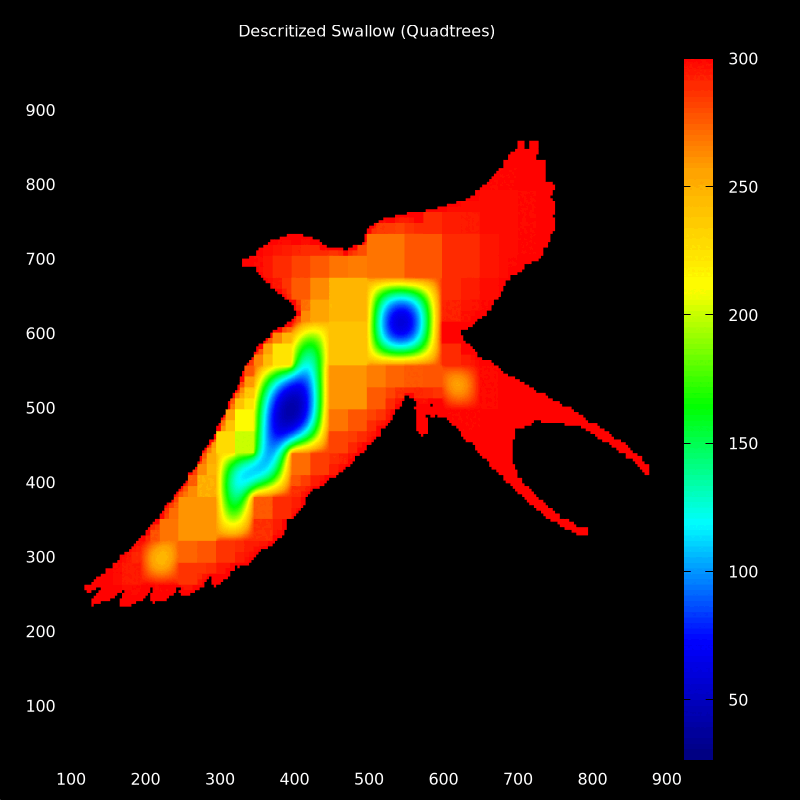

this is SE (Simulation Engine - framework) project. The concept is of some equivalent of XNA4, but   
targeted for writing simulations. The project aims to be a framework built with F#, while using an OpenGL  
renderer, built with OpenTK.   

It is still in early stage. (Very early stage!!)   

It can load and render .gltf files from FreeCAD or other CAD software.   
Then by leveraging some simplistic ECS (Entity-Component-System) design simulations on these   
these geometries.

Each directory contains a `.fsproj`, alongside a `tests/` dir containing examples for that `.fsprj`.   
There is also some `scripts/` directory with scripts for formating and deserializing into text   
gltf -bin files. And also some simple `Unnamed-Body.gltf` object for helping with development of   
`src/gltfoader.fs` and rendering.


TODO: At some point, I will try to implement some basic algorithms for grid generation, solvers, etc    
as a physics engine for the project, to make working with the imported gltf CAD files easier.

**UPDATE**: The `SE-core/src` updated and now it contains Quadtree and Octree implementations for descretizing      
geometries, and solving PDEs on them. Take a look at `tests/` directories for examples of the API.   


- `SE-renderer/tests/octree_test.fsx` (for octree example)
- `SE-core/tests/animation_test.fsx` (for quadtree example)

(to compile a gif from a series of images use the cmd)
```
convert -delay 20 -loop 0 *.png swallow_volume.gif  
```


