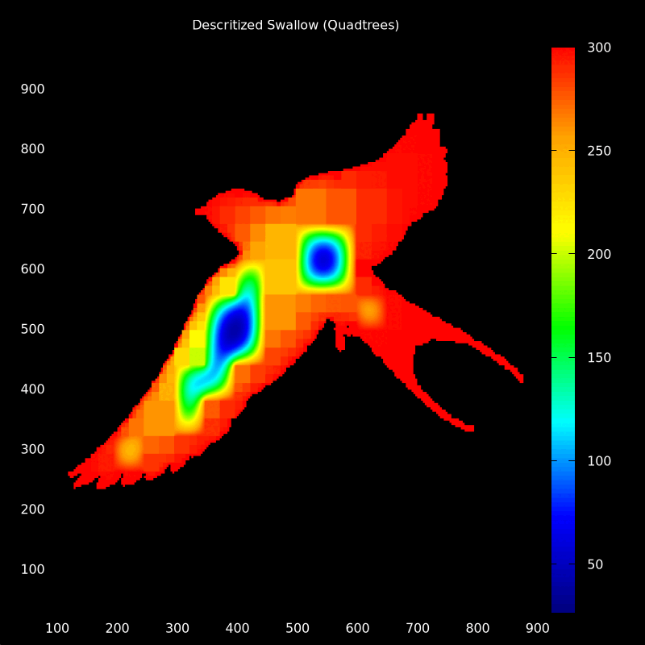
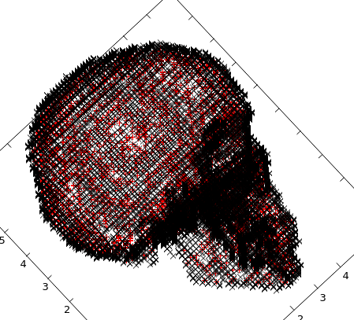
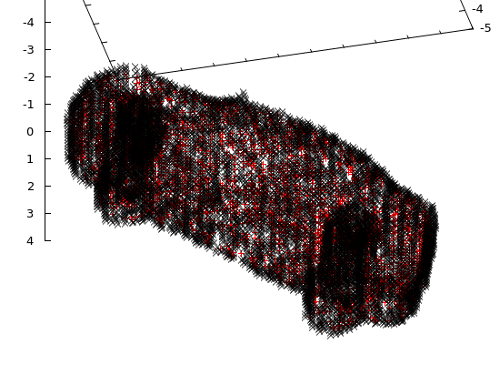
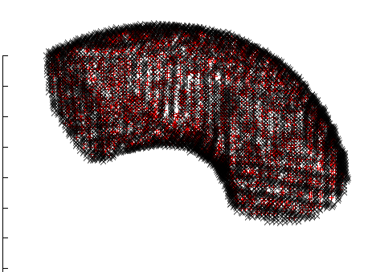
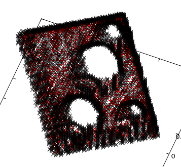

this is SE (Simulation Engine - framework) project. The concept is of some equivalent of XNA4, but   
targeted for writing simulations. The project aims to be a framework built with F#, while using an OpenGL  
renderer, built with OpenTK.   

It can load and render .gltf files from FreeCAD or other CAD software.   
Then by leveraging some simplistic ECS (Entity-Component-System) design simulations on these   
these geometries.   

You can find such an example at `src/SE-physics/tests/combustion_3d_test.fsx`.    

Each directory contains a `.fsproj`, alongside a `tests/` dir containing examples for that `.fsprj`.   
There is also some `scripts/` directory with scripts for formating and deserializing into text   
gltf -bin files. There is also a couple of 3d geometries in `models/` directory to help testing during the development.    

**UPDATE**: The `SE-core/src` updated and now it contains *Quadtree* and *Octree* implementations for descretizing      
geometries, and solving PDEs on them. Take a look at `tests/` directories for examples of the API.   

**WARNING**: many examples use *Gnuplot* for plotting, so in order to run these scripts, make sure Gnuplot is installed in device and set to `$PATH`.

- `SE-renderer/tests/octree_test.fsx` (for octree example)
- `SE-core/tests/animation_test.fsx` (for quadtree example)

**UPDATE:** with latest PR some improvements were made, both in parallelization     
            and various other fixes. For discretization if `Octree.ofSurface<'T> mesh` has issues    
            the cause is probably, that some of the vertices of the mesh are parallel to    
            the 'ray-cast-direction'. The simplest solution to resolve that issue,      
            is before creating the Octree, to transform the mesh with `SE.Renderer.RGeometry.transform`    
            A simple slight rotation will do.    


### Quadtree Discretization

(to compile a gif from a series of images use the cmd)
```
convert -delay 20 -loop 0 *.png swallow_volume.gif  
```

### Octree Discretization
these are some examples of the Octree-descritization on the 3d geometries in `models/` directory:    
(black points are boundary points, while red points are internal)   

|    |           |
|----------|:-------------:|
|  |   |
|  |      |


