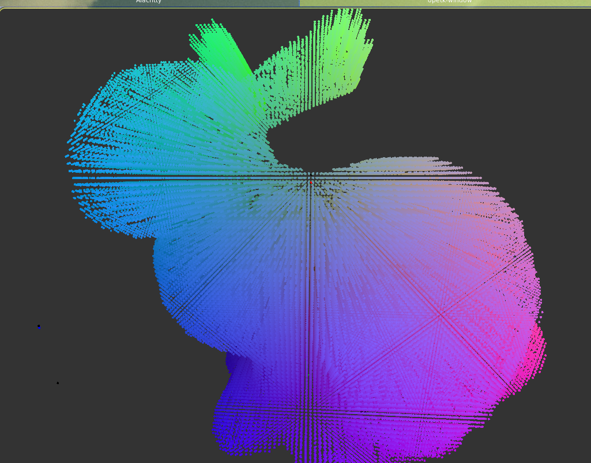

This project uses OpenTK4 to render 3d graphics.   
Its purpose is to load .gltf files, provide some helper functions for discretizing volumes out of   
surfaces. Iterating meshes of `(vertex_buffer * index_buffer)`, calculating normals for these surfaces etc.

The following images display a 3d model and the same model discretized.   

incorrect discretized bunny (cool nonetheless)   

correct discretized bunny (not that impressive though)  

**WARNING:** It's been an attemp to implement animatations from .gltf and and voxelize the `body` at each    render frame. At directory `videos` and `tests/gltfloader_test.fsx` there is a sample of that attempt    
that fails miserably.   
tldr; Many fixes are essential...  
