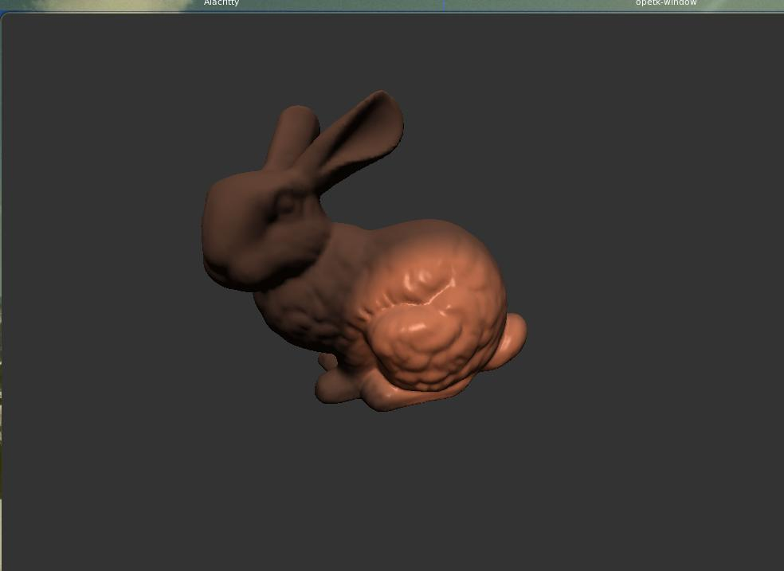
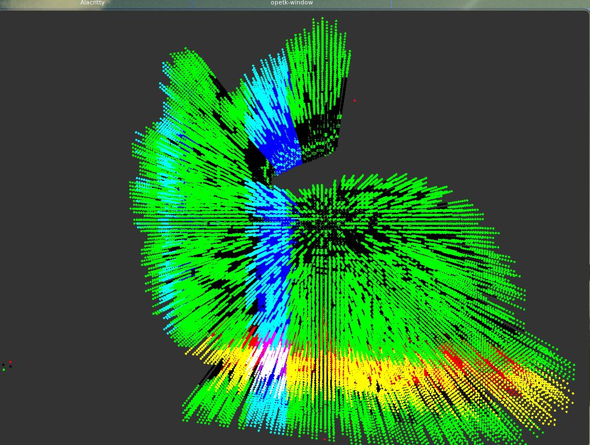

This project uses OpenTK4 to render 3d graphics.   
Its purpose is to load .gltf files, provide some helper functions for discretizing volumes out of   
surfaces. Iterating meshes of `(vertex_buffer * index_buffer)`, calculating normals for these surfaces etc.

The following images display a 3d model and the same model discretized.   

