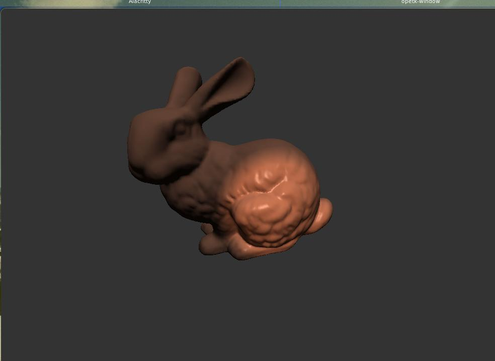
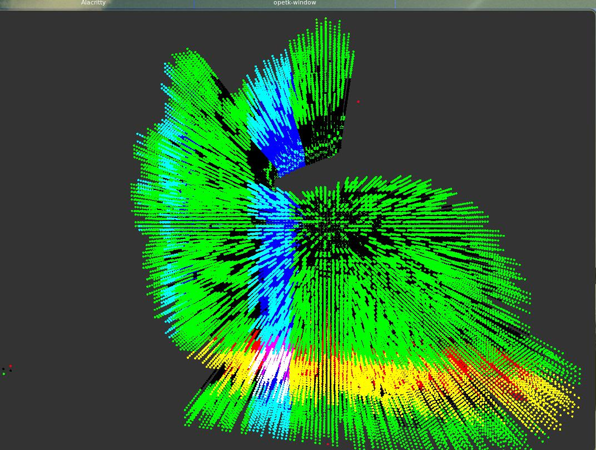
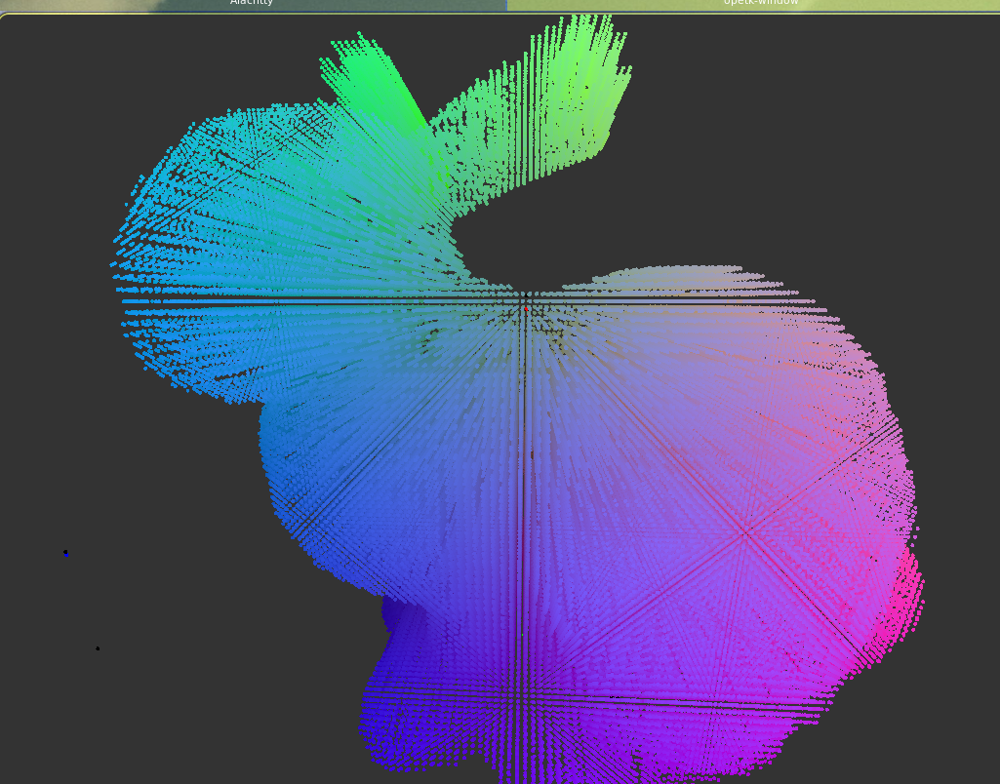

This project uses OpenTK4 to render 3d graphics.   
Its purpose is to load and display.gltf files, while providing some helper functions for making rendering through the ECS architecture of the `SE.ECS` namespace easier.    

You can find the example of the rendering with the `SE.Renderer` and `SE.ECS` namespaces in `tests/ecs_renderer_test.fsx`

**UPDATE**: Reference to `FFMPegCore` project has been included, so now it is possible to capture the OpenGL-window as an .mp4 video.

The following images display a 3d model and the same model discretized.   

incorrect discretized bunny (cool nonetheless)   

correct discretized bunny (not that impressive though)  

 
